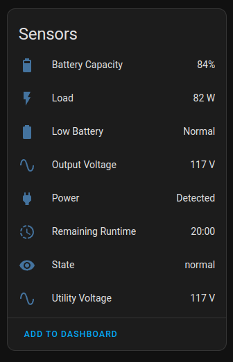

# hass-pwrstat

An integration to poll a _Cyberpower_ UPS through [pwrstat-api](https://github.com/sbruggeman/pwrstat-api).


## Thanks

Many thanks to:
* [JetBrains](https://www.jetbrains.com/?from=hass-aarlo) for the excellent
  **PyCharm IDE** and providing me with an open source licence to speed up the
  project development.

  [](https://www.jetbrains.com/?from=hass-aarlo)

* @bruggeman for the `pwrstat-api` wrapper.


## Introduction

I wrote this to compliment the _pwrstat-api_ wrapper. I've been accessing the
wrapper using the [RESTful API](https://www.home-assistant.io/integrations/rest/)
integration and it was working great. But it was lacking full _Integration_ 
support and monitoring more than one UPS was a pain to change the config. 

I decided to add proper _Integration_ support.


## Installation

### The `pwrstat-api` Software
Install and get that running first. This _Integration_ does nothing without
it. The software is a quite simple _Python_ script to you could run it 
inside a virtual env if you want. The goal is get a server running that 
returns a _JSON_ description of the _UPS_.

```shell
wget -q -O - http://127.0.0.1:5002/pwrstat
{"Battery Capacity": "80 %", "Firmware Number": "BF01902B1D1z", "Last Power Event": "Blackout at 2023/11/25 22:04:46 for 15 sec", "Line Interaction": "None", "Load": "86 Watt(23 %)", "Model Name": "ST Series", "Output Voltage": "116 V", "Power Supply by": "Utility Power", "Rating Power": "375 Watt", "Rating Voltage": "120 V", "Remaining Runtime": "19 min", "State": "Normal", "Test Result": "Passed at 2022/08/24 10:20:31", "Utility Voltage": "116 V"}
```

### The `pwrstat` Integration

#### HACS
[](https://github.com/hacs/integration)

Not yet...

#### Manually
Copy the `pwrstat` directory into your `/config/custom_components` directory.

#### From Script
Run the installation script. Run it once to make sure the operations look sane
and run it a second time with the `go` parameter to do the actual work. If you
update just rerun the script, it will overwrite all installed files.

```shell
install /config
# check output looks good
install go /config
```

Restart your _Home Assistant_ installation.


## Configuration

Follow these steps:

- Navigate to `Settings -> Devices & Services`.
- Click on `+ ADD INTEGRATION`. 
- Search for `cyberpower` and select it.
- Enter the _UPS_ name, its exact URL including the scheme, and how often you 
  want to poll the device.
- Click `Submit`.

If it works you should see this:



You can enter more than one _UPS_.


## Other

### Energy Sensor

You can create an energy sensor to convert `W` into `kWh` with something 
similar to this:

```yaml
- platform: integration
  source: sensor.pwrstat_office_ups_load
  name: pwrstat_office_ups_energy
  unit_prefix: k
  round: 2
  method: left
```

